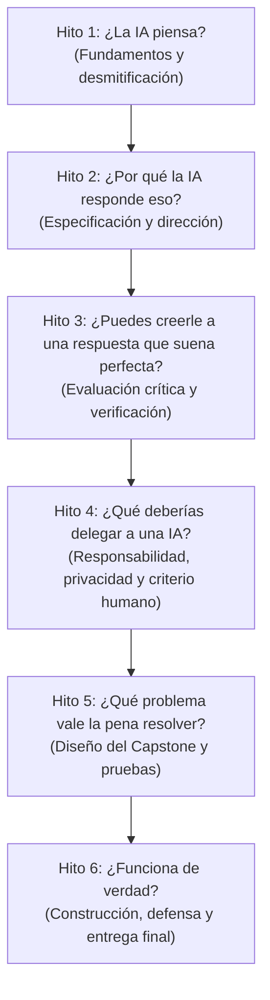

# DAEMON ARC — Currículo de Referencia V1
# IA: Origen (Teens)

> **Documento Fuente de Verdad Curricular**  
> Código de Versión Canónica: `IA_ORIGEN_TEENS_2026_V1`  
> Slug: `ia-origen-teens`  
> Audiencia: `TEENS` (13 a 17 años) | Dificultad: `INICIAL` | Duración: `6 semanas` (18 experiencias)  
> Propuesta pedagógica: Alfabetización crítica y colaboración humano–IA, no mero "prompt engineering".

---

## 1. Promesa del Curso

**"IA: Origen — Entiende, dirige, verifica y crea con inteligencia artificial."**

Al finalizar el curso, el estudiante es capaz de:
1. **Explicar** a nivel conceptual y útil cómo funcionan los sistemas de IA modernos (datos, modelos, entrenamiento, inferencia).
2. **Dirigir** una IA generativa mediante especificaciones estructuradas y criterios explícitos, no por tanteo ciego.
3. **Evaluar** críticamente los resultados generados identificando fortalezas, omisiones, supuestos y calidad.
4. **Verificar** afirmaciones factuales utilizando fuentes independientes y reconociendo el riesgo de alucinación.
5. **Decidir** de manera responsable cuándo utilizar IA, qué datos proteger (privacidad y datos sensibles) y cómo preservar el juicio humano.
6. **Diseñar, probar y defender** una solución asistida por IA para un problema real, manteniendo trazabilidad completa de sus decisiones.

---

## 2. Objetivos de Aprendizaje Canónicos

| Código | Dimensión | Descripción | Evidencia Observable |
| :--- | :--- | :--- | :--- |
| **AI-01** | **UNDERSTAND** | Explica la relación básica entre datos, entrenamiento, modelo, entrada, inferencia y salida; distingue entre automatización con reglas, machine learning e IA generativa. | Descompone un sistema de IA cotidiano identificando qué entra, qué hace el modelo, qué sale y qué limitaciones tiene. |
| **AI-02** | **DIRECT** | Construye y mejora iterativamente instrucciones para una IA generativa usando contexto, tarea, restricciones, ejemplos, formato esperado y criterios de éxito. | Bitácora de iteración con versiones (V1, V2, V3) justificando el porqué de cada cambio y mejora observada. |
| **AI-03** | **EVALUATE** | Evalúa respuestas generadas por IA mediante criterios explícitos en lugar de aceptarlas acríticamente. | Matriz de evaluación que identifica fortalezas, vacíos, supuestos no sustentados y calidad en respuestas generadas. |
| **AI-04** | **VERIFY** | Verifica afirmaciones factuales generadas por IA usando fuentes confiables e independientes, reconociendo el riesgo de alucinación e incertidumbre. | Registro de verificación: afirmación, respuesta de IA, fuente de contraste, veredicto, corrección y nivel de certeza. |
| **AI-05** | **USE RESPONSIBLY** | Razona sobre privacidad, datos personales, sesgos, medios sintéticos/deepfakes, atribución e integridad académica. | Justificación razonada de cuándo un uso de IA es apropiado, cuándo requiere salvaguardas y cuándo debe rechazarse. |
| **AI-06** | **BUILD** | Diseña, prueba y defiende una solución asistida por IA para un problema real manteniendo trazabilidad de las decisiones humanas. | Capstone completo: problema, flujo humano–IA, casos de prueba, fallas detectadas, producto final, limitaciones y defensa. |

---

## 3. Política de Uso de IA del Curso y Seguridad para Menores

### Lo que está permitido y promovido:
- Usar herramientas de IA aprobadas para actividades del curso.
- Iterar instrucciones y comparar respuestas entre modelos o formulaciones.
- Hacer lluvia de ideas, estructurar borradores y depurar ideas.
- Probar límites, detectar fallas y plantear preguntas críticas.

### Lo que es obligatorio:
- Declarar de forma transparente el rol y uso de la IA en cada entrega.
- Registrar las iteraciones clave cuando la actividad lo solicite.
- Contrastar y verificar afirmaciones factuales antes de darlas por ciertas.
- Explicar las decisiones personales tomadas en cada producto.

### Lo que no es aceptable:
- Entregar una respuesta de IA haciéndola pasar por razonamiento personal sin revisión.
- Subir datos personales identificables (nombres completos, teléfonos, direcciones, documentos escolares, fotos íntimas, información de salud o de familia).
- Inventar fuentes o aceptar citas bibliográficas fabricadas por la IA.
- Delegar a la IA la responsabilidad ética o el criterio final sobre el trabajo.

---

## 4. Estructura Curricular: 6 Hitos y 18 Experiencias

---

### Hito 1: ¿La IA piensa?
*Propósito:* Desarmar el pensamiento mágico. Construir el modelo mental necesario: datos, patrones, entrenamiento e inferencia.

1. **M1-E1 (Lección) — IA no es magia**
   - *Objetivos:* `AI-01`
   - *Conceptos:* Reglas fijas vs. patrones aprendidos; datos → entrenamiento → modelo → entrada → inferencia → salida.
   - *Regla de completitud:* `lesson_completion` (marcar avance curricular).
2. **M1-E2 (Laboratorio) — Entrena, prueba y rompe un modelo simple**
   - *Objetivos:* `AI-01`
   - *Actividad:* Experimentar con clasificación usando datasets preparados o Teachable Machine (demostración / sin cuenta requerida). Probar qué pasa con datos desbalanceados o ejemplos fuera de distribución.
   - *Evidencia:* Registro de experimento (¿Qué cambié? ¿Qué pasó? ¿Por qué? ¿Qué limitación descubrí?).
   - *Regla de completitud:* `submission` (entrega de texto).
3. **M1-E3 (Misión) — Radiografía de una IA cotidiana**
   - *Objetivos:* `AI-01`, `AI-05`
   - *Actividad:* Seleccionar una herramienta cotidiana (recomendaciones, filtros, asistentes, moderación) y descomponerla en: entrada, datos estimados, modelo, salida y posibles errores o sesgos.
   - *Evidencia:* Ficha estructurada de análisis.
   - *Regla de completitud:* `submission`.

---

### Hito 2: ¿Por qué la IA responde eso?
*Propósito:* Aprender a comunicarse con modelos generativos tratándolo como la especificación estructurada de una tarea, no como "trucos de magia".

1. **M2-E1 (Lección) — De una idea vaga a una instrucción verificable**
   - *Objetivos:* `AI-02`
   - *Conceptos:* Estructura canónica de especificación: Contexto + Tarea + Restricciones + Ejemplos + Formato + Criterios de éxito.
   - *Regla de completitud:* `lesson_completion`.
2. **M2-E2 (Práctica) — Mejora la instrucción**
   - *Objetivos:* `AI-02`, `AI-03`
   - *Actividad:* Analizar tres instrucciones débiles y ambiguas, diagnosticar qué les falta y reescribirlas aplicando restricciones y formato esperado.
   - *Evidencia:* Diagnóstico y versión mejorada de las instrucciones.
   - *Regla de completitud:* `submission`.
3. **M2-E3 (Misión) — Tres intentos, una mejor decisión**
   - *Objetivos:* `AI-02`, `AI-03`
   - *Actividad:* Ejecutar una tarea generativa auténtica registrando tres iteraciones obligatorias (V1, V2, V3), explicando qué cambió entre cada versión y qué criterio justificó la mejora.
   - *Evidencia:* Bitácora de 3 iteraciones con razonamiento explícito.
   - *Regla de completitud:* `submission`.

---

### Hito 3: ¿Puedes creerle a una respuesta que suena perfecta?
*Propósito:* Fomentar el escepticismo metodológico. Fluidez no es veracidad.

1. **M3-E1 (Lección) — Convincente no significa correcto**
   - *Objetivos:* `AI-03`, `AI-04`
   - *Conceptos:* Modelos probabilísticos vs. bases de conocimiento; alucinaciones; por qué la IA inventa fuentes; confianza artificial vs. evidencia.
   - *Regla de completitud:* `lesson_completion`.
2. **M3-E2 (Desafío) — Detective de respuestas**
   - *Objetivos:* `AI-03`, `AI-04`
   - *Actividad:* Recibir un texto generado por IA con datos correctos, datos engañosos y afirmaciones inventadas. Clasificar cada afirmación en: verificada, dudosa, falsa o sin evidencia suficiente.
   - *Evidencia:* Tabla de clasificación de afirmaciones con justificación.
   - *Regla de completitud:* `submission`.
3. **M3-E3 (Evaluación) — Verifica antes de repetir**
   - *Objetivos:* `AI-04`, `AI-05`
   - *Actividad:* Caso individual donde el estudiante debe extraer 3 a 5 afirmaciones concretas de una respuesta de IA, contrastarlas con fuentes independientes confiables y redactar la versión corregida con notas de certeza.
   - *Evidencia:* Informe de verificación con enlaces a fuentes y correcciones.
   - *Regla de completitud:* `submission`.

---

### Hito 4: ¿Qué deberías delegar a una IA?
*Propósito:* Responsabilidad ética, privacidad, sesgos y centralidad del criterio humano.

1. **M4-E1 (Lección) — La decisión sigue siendo humana**
   - *Objetivos:* `AI-05`
   - *Conceptos:* Privacidad, datos personales sensibles (PII), sesgo algorítmico, medios sintéticos y deepfakes; la responsabilidad intransferible del autor humano.
   - *Regla de completitud:* `lesson_completion`.
2. **M4-E2 (Laboratorio) — Compara, cuestiona, decide**
   - *Objetivos:* `AI-03`, `AI-05`
   - *Actividad:* Comparar dos respuestas generadas ante una misma situación ética o dilema práctico, contrastando sesgos potenciales, supuestos ocultos y decidiendo cuál tiene mejor sustento y qué debe modificarse humanamente.
   - *Evidencia:* Cuadro comparativo de criterios éticos y decisión humana final.
   - *Regla de completitud:* `submission`.
3. **M4-E3 (Misión) — Crea algo útil sin entregar tu criterio**
   - *Objetivos:* `AI-02`, `AI-05`
   - *Actividad:* Elaborar un recurso de estudio o divulgación asistido por IA, documentando explícitamente qué aportó la IA, qué aportó el estudiante, qué sugerencias de la IA fueron rechazadas y por qué.
   - *Evidencia:* Recurso final + declaración de aportes y descartes humanos.
   - *Regla de completitud:* `submission`.

---

### Hito 5: ¿Qué problema vale la pena resolver?
*Propósito:* Inicio formal del Proyecto Capstone. Definición del problema real y diseño de la colaboración humano–IA.

1. **M5-E1 (Proyecto) — Capstone 1: Define el problema**
   - *Objetivos:* `AI-06`
   - *Actividad:* Redactar el Project Brief del proyecto final: problema real elegido (escuela, comunidad, estudio, creatividad), usuario objetivo, criterio de éxito, rol específico de la IA y límites de seguridad de datos.
   - *Evidencia:* Project Brief estructurado.
   - *Regla de completitud:* `submission`.
2. **M5-E2 (Misión) — Diseña el flujo humano–IA**
   - *Objetivos:* `AI-02`, `AI-05`, `AI-06`
   - *Actividad:* Diagramar o redactar paso a paso el flujo de trabajo: qué hace el humano en cada paso, qué genera la IA, en qué momentos se realiza la revisión humana obligatoria y qué queda estrictamente fuera del alcance de la IA.
   - *Evidencia:* Especificación del flujo de trabajo humano–IA.
   - *Regla de completitud:* `submission`.
3. **M5-E3 (Proyecto) — Capstone 2: Prueba antes de confiar**
   - *Objetivos:* `AI-03`, `AI-04`, `AI-06`
   - *Actividad:* Diseñar y ejecutar al menos 3 casos de prueba rigurosos para la solución (caso típico, caso ambiguo/difícil y caso de falla/adversarial), documentando los errores encontrados y los ajustes requeridos.
   - *Evidencia:* Bitácora de casos de prueba y fallas descubiertas.
   - *Regla de completitud:* `submission`.

---

### Hito 6: ¿Funciona de verdad?
*Propósito:* Construcción final, revisión basada en pruebas, defensa de decisiones y reflexión metacognitiva.

1. **M6-E1 (Proyecto) — Construye, prueba y mejora**
   - *Objetivos:* `AI-06`
   - *Actividad:* Producir la versión funcional del artefacto o solución (guía, protocolo, herramienta no-code, asistente documentado) aplicando al menos una mejora significativa derivada de las pruebas del Hito 5.
   - *Evidencia:* Artefacto revisado con notas de cambios post-pruebas.
   - *Regla de completitud:* `submission`.
2. **M6-E2 (Evaluación) — Defiende tus decisiones**
   - *Objetivos:* `AI-01`, `AI-05`, `AI-06`
   - *Actividad:* Preparar y registrar la defensa de decisiones: ¿Por qué elegiste este problema? ¿Qué hizo la IA y qué hiciste tú? ¿Dónde falló la IA y cómo lo resolviste? ¿Qué riesgos mitigaste?
   - *Evidencia:* Síntesis de defensa y respuestas a las preguntas críticas de auditoría humana.
   - *Regla de completitud:* `submission`.
3. **M6-E3 (Proyecto) — Entrega final: lo que construí y lo que aprendí**
   - *Objetivos:* `AI-01`, `AI-02`, `AI-03`, `AI-04`, `AI-05`, `AI-06`
   - *Actividad:* Paquete integral de entrega final: Project Brief + Flujo de trabajo + Registro de iteraciones + Registro de pruebas + Artefacto final + Fuentes + Declaración de uso responsable + Reflexión final.
   - *Evidencia:* Carpeta integral del proyecto y ensayo reflexivo de cierre.
   - *Regla de completitud:* `submission`.

---

## 5. Rúbrica Pedagógica del Proyecto Capstone (Evaluación Formativa y Humana)

| Criterio | Nivel Inicial | Nivel Logrado | Nivel Sobresaliente |
| :--- | :--- | :--- | :--- |
| **1. Definición del problema** | Problema vago o sin usuario claro. | Problema concreto con usuario y necesidad identificados. | Problema auténtico, bien delimitado y con métricas de éxito claras. |
| **2. Rol Humano–IA** | La IA hace todo o su rol no está definido. | Roles diferenciados con puntos de revisión humana. | Colaboración sinérgica donde el humano dirige y audita críticamente. |
| **3. Alfabetización en IA** | Cree que la IA "sabe" o "entiende". | Reconoce limitaciones probabilísticas del modelo usado. | Explica con precisión cómo los datos y la inferencia condicionan la respuesta. |
| **4. Evaluación crítica** | Acepta las respuestas generadas sin cuestionar. | Detecta omisiones y supuestos no sustentados. | Aplica criterios rigurosos de calidad, pertinencia y coherencia. |
| **5. Verificación factual** | No contrasta fuentes o inventa citas. | Verifica afirmaciones clave con fuentes independientes. | Triangula información y declara explícitamente niveles de certeza. |
| **6. Iteración y proceso** | Un solo intento sin revisiones. | Registra cambios entre versiones pero con poca justificación. | Trazabilidad completa de V1 a V3 justificando cada decisión de cambio. |
| **7. Uso responsable** | No considera privacidad ni sesgos. | Declara el uso de IA y protege datos personales. | Analiza activamente sesgos, minimiza riesgos y cita adecuadamente. |
| **8. Calidad del producto** | El artefacto no responde al problema planteado. | Solución funcional que atiende el problema propuesto. | Producto sólido, probado en condiciones difíciles y con límites claros. |
| **9. Defensa de decisiones** | Depende de la IA para explicar su trabajo. | Explica razonablemente qué decisiones tomó por su cuenta. | Argumenta con solvencia técnica y ética cada elección de diseño. |
| **10. Reflexión metacognitiva** | Reflexión genérica o complaciente. | Identifica aprendizajes y fallas encontradas. | Autocrítica profunda sobre qué haría distinto y cuándo no usaría IA. |

---

## 6. Acompañamiento en Sesiones en Vivo (Agenda)

El curso se articula con 6 sesiones sincrónicas semanales de 60 minutos con el docente de cohorte:
- **Semana 1:** Clínica de desmitificación de IA y demostración de modelos interactivos.
- **Semana 2:** Taller de especificación de tareas y depuración de instrucciones en vivo.
- **Semana 3:** Taller práctico de "Fact-Checking" y detección de alucinaciones.
- **Semana 4:** Debate socrático sobre dilemas éticos, privacidad y derechos de autor.
- **Semana 5:** Clínica de diseño y pruebas de estrés para los proyectos Capstone.
- **Semana 6:** Feria de demostración, defensas breves y retroalimentación colectiva.
